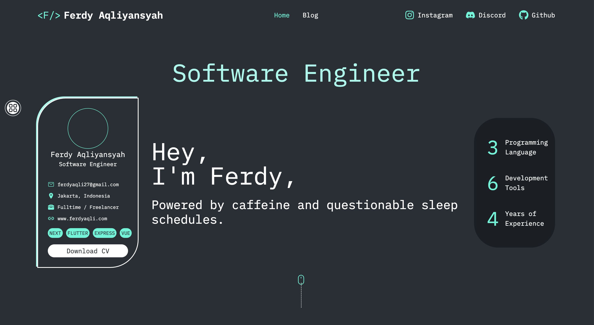
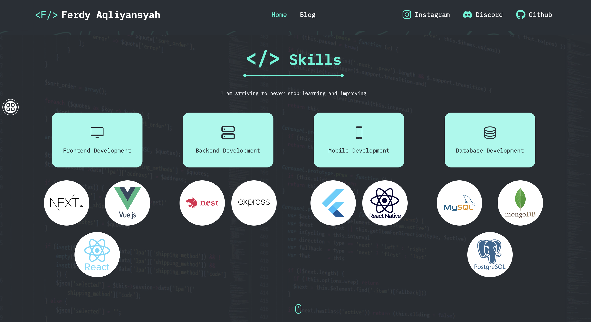
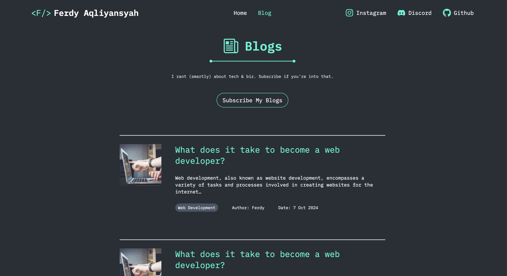

# 🚀 My Profile Website





Figma reference: https://www.figma.com/community/file/1308624569713896610 (by [Johan Leon](https://www.figma.com/@johannleon2025))

## Run Locally

Clone the project

```bash
  git clone https://github.com/cotbakheu/WCD_Assignments
```

Go to the project directory

```bash
  cd WCD_Assignments
```

Install dependencies

```bash
  npm install
```

Start the application

```bash
  npm run tugas-3
```
